# CADlaberote
Utilidades sencillas en lisp para arquitectura en Autocad (hacer muros, puertas, ventanas...).

Todas utilidades funcionan por línea de comandos, algunos comandos tienen dos nombres (uno largo y uno corto).

En las instrucciones si no funciona algún comando por estar escrito en inglés añade un guión bajo al inicio (por ejemplo, si no funciona appload usa _appload)

Está pensado para dibujos en metros, ya que las medidas por defecto del ancho del muro son 30cm (0.3) y de las puertas 72cm (0.72)

## Instalación
1. Descarga los ficheros y descomprímelos en una carpeta (y recuerda su nombre).
2. Abre autocad
3. Escribe OPTIONS (u _options), Despliega el apartado "Support File Search Path" o "Ruta de Búsqueda de Archivos de Soporte", y añade la carpeta del punto 1)

**IMPORTANTE**: Si tu versión de Autocad tiene la opción de "Trusted locations" o "Ubicaciones de confianza", debes añadir la carpeta anterior también en este apartado 
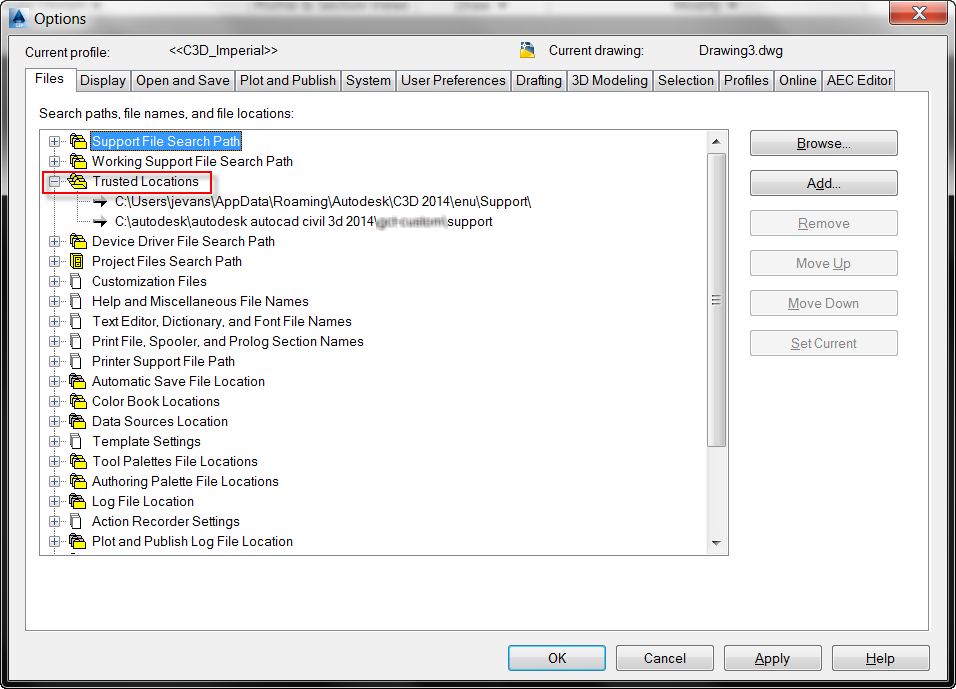

5. Escribe ahora APPLOAD (o _appload), elige "Startup suite" o "Cargar al inicio" y navega hasta la carpeta del punto 1. De todos los ficheros elegir "Arquitectura.lsp"

7. Si todo es correcto en la consola aparece un mensaje que dice "Programas de arquitectura preparados"
8. Opcionalmente, se puede cargar una personalización que muestra una barra flotante con acceso a las herramientas de arquitectura. 
Para ello, escribe CUI (o _cui), y marca el icono de añadir un fichero:

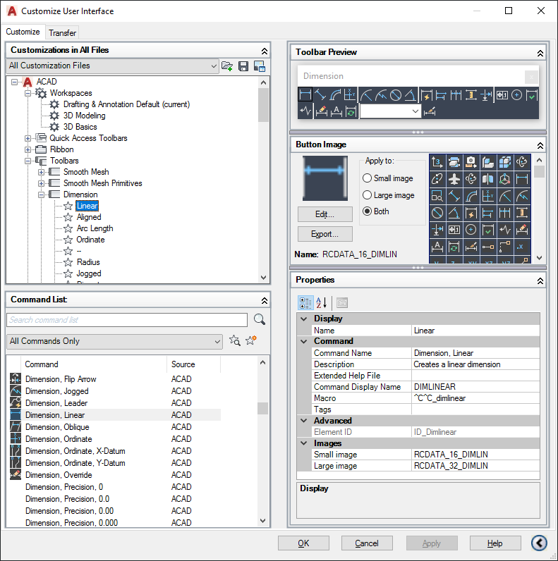

Navega hasta la carpeta del punto 1), elige Arquitectura y acepta todas las ventanas. Te aparecerá la barra flotante de las herramientas de arquitectura

## Funciones de dibujo
## muro o mr
Crea un muro. Se elige el punto inicial y final del muro (que definen una de las líneas paralelas) y el lado para el que va el muro (donde irá la línea paralela que define el muro). También da la opción de cerrar el muro. 

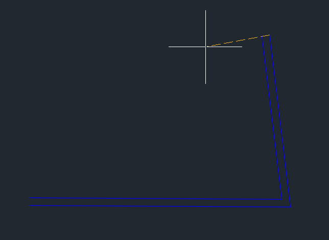

Para cambiar el ancho del muro, una vez marcado un primer punto del muro usar la opción por línea de comandos "Ancho".

El programa identifica como muro a cualquier par de líneas paralelas de la capa Muros.

### puerta o pt
Crea una puerta. Pide el punto en el que se sitúa la bisagra y hacia donde abre la puerta. 

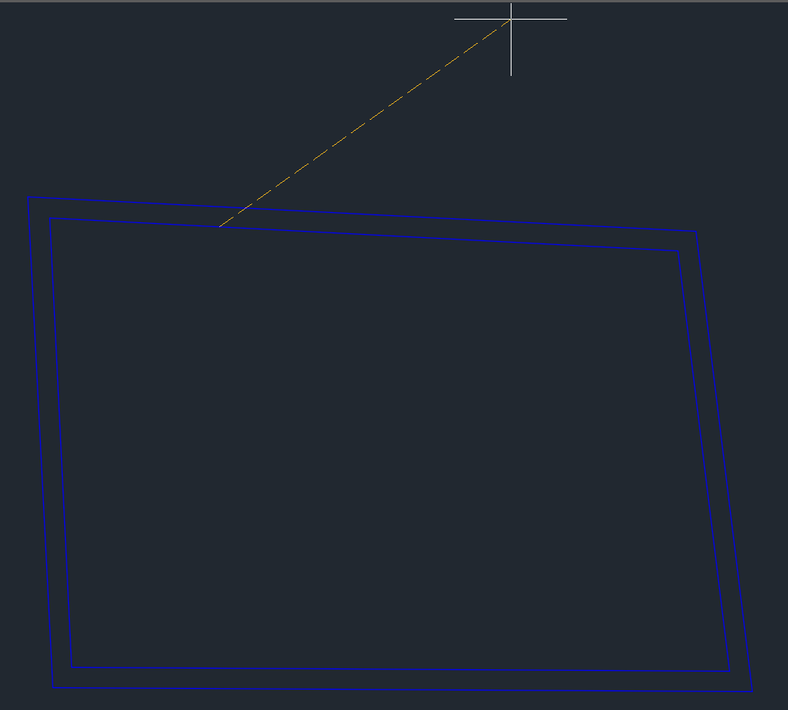

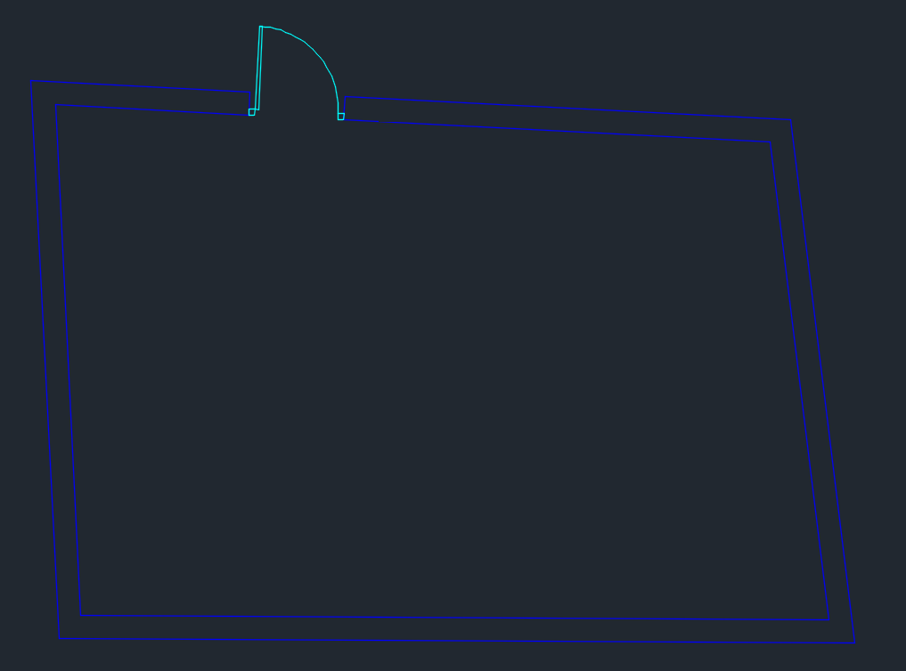

Debe estar situada en un muro creado con la orden muro (o en dos líneas paralelas de la capa Muros). 

La puerta se crea en la capa Carpinteria

### puertadoble o ptd
Igual que puerta, pero doble.

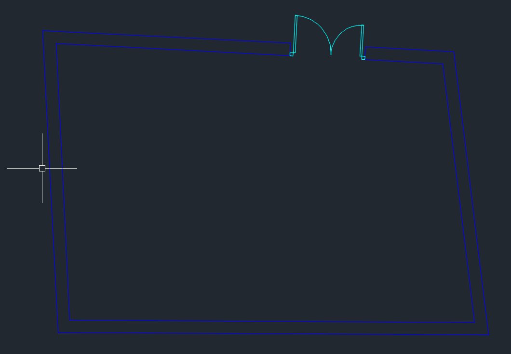

## ventana o ven
Genera una ventana, de forma similar a cómo se crea una puerta y en su misma capa (Carpinteria).

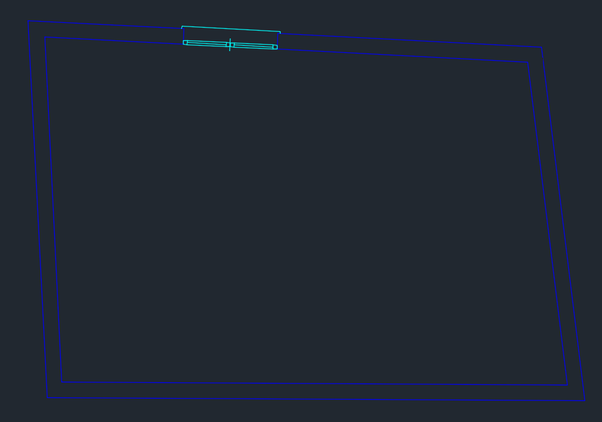

## Funciones para modificar puertas y ventanas
### modifipt o mop
Muestra una imagen de una puerta simple y pide los parámetros de la puerta (tamaño de la jamba y de la hoja)

### modifptd o mopd
Muestra la imagen de una puerta doble y pide los parámetros de las puerdas dobles (tamaño de las jambas y de las dos hojas)

### modifven o moven
Muestra la imagen de una ventana simple y una ventana doble y pide sus parémtros:
- Tipo de ventana: simple, doble, 3 hojas o 4 hojas
- Lleva alfeizar: si o no
- Tamaño del cristal
- Ancho del perfil
- Centrar en el muro: si o no

### gic o giracarp
Seleccionando una puerta/ventana (simple o doble) permite cambiarle la dirección en cualquiera de los dos ejes.

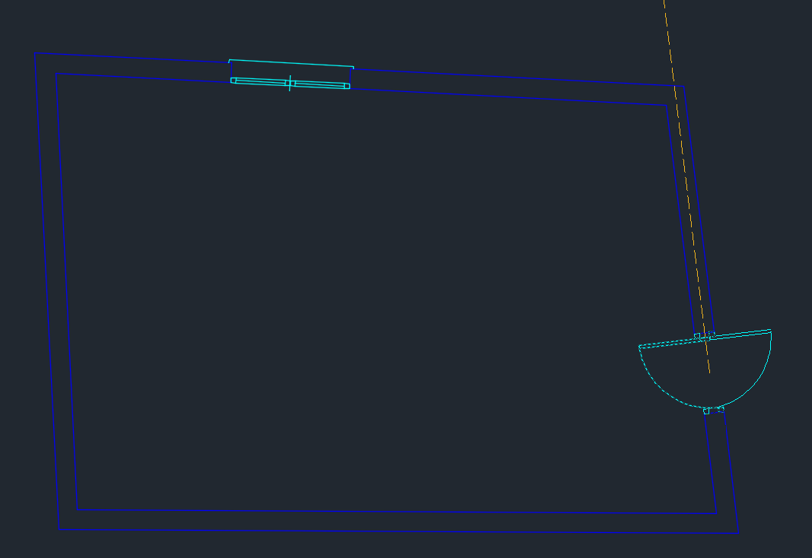

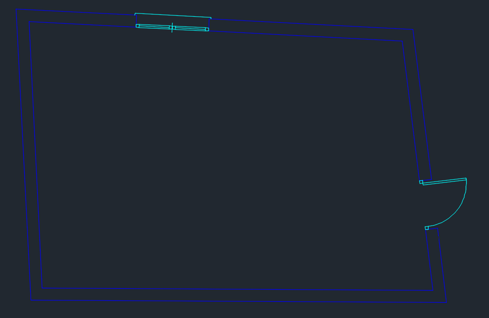
### despcarp o dpc
Seleccionando una puerta/ventana (simple o doble) permite desplazarla en la dirección del muro en el que está.

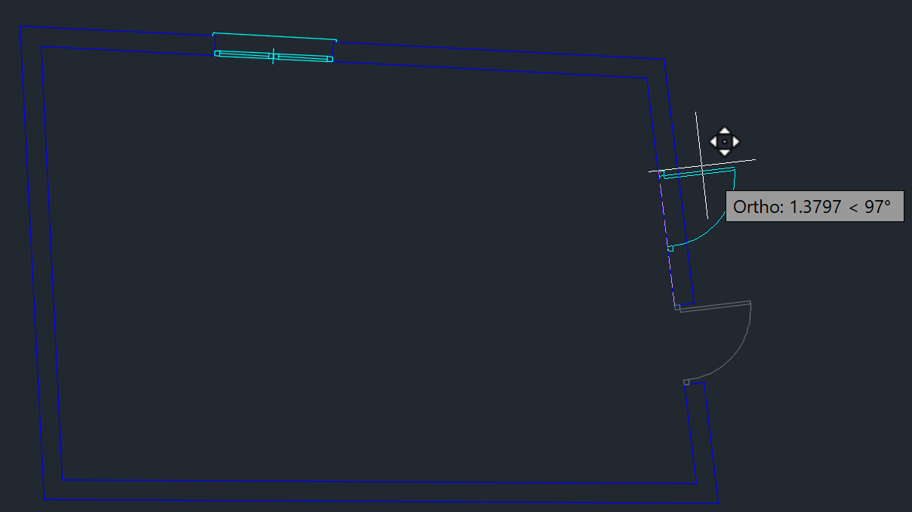

### borracarp o boc
Borra una carpintería y restablece el muro.

## Utilidades varias
### aplasta
Le aplica cota 0 (valor z=0) a todas las entidades del dibujo actual.

### continua
Crea una cota continua: se marca una línea de inicio y una línea de fin y genera cotas de todos los elementos que se crucen con la línea dada. 

Las cotas serán horizontales o verticales según sea la inclinación de la línea dada. 

Adicionalmente, pide la posición en la que van las cotas.

Las cotas se crean en la capa Cotas.

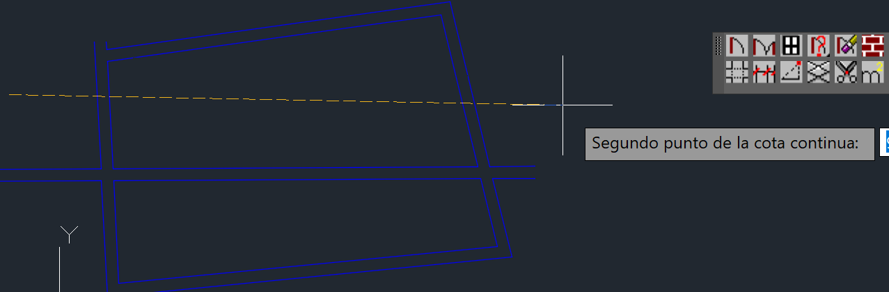

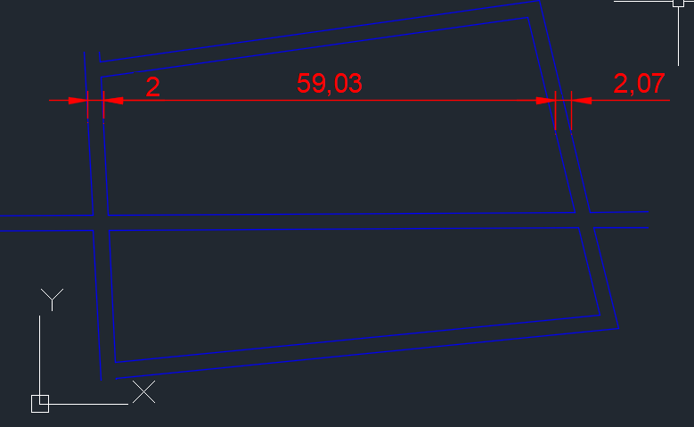
### corta o xtrim
Marcando un punto corta el segmento marcado hasta la intersección más próxima. Útil por ejemplo si se cruzasen dos muros y no se hace correctamente la union, para borrar los cruces.

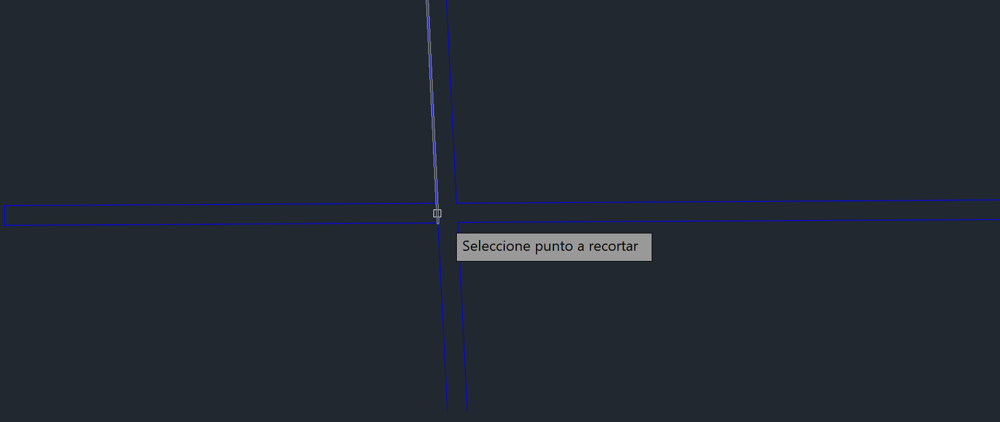

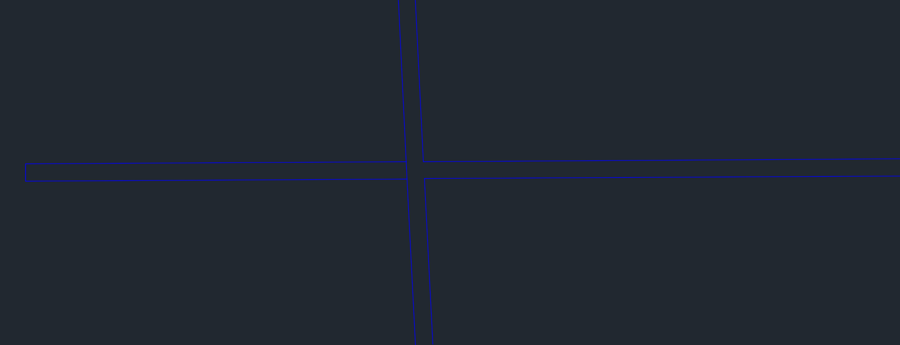

### extiende o xtend
Marcado una entidad (por ejemplo, una línea), extiende el extremo más cercano al punto seleccionado hasta la primera entidad con la que se cruce.

Por ejemplo, en este cruce de muros si se marca el extremo de una línea la extiende hasta el otro lado del muro.

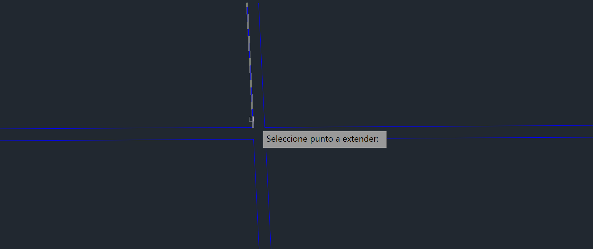

Dando como resultado:

### triang
Dibuja un triángulo, preguntando primero por una línea que sirve de base al triángulo, luego las distancias respecto a cada uno de los dos extremos de la línea base y la dirección hacia la que se quiere dibujar el triángulo.

### une
Esta orden sirve para unir dos muros se cruzan y no están correctamente unidos (recortando las intersecciones). Para ello, marcar con una ventana la intersección de los dos muros y el programa los unirá.

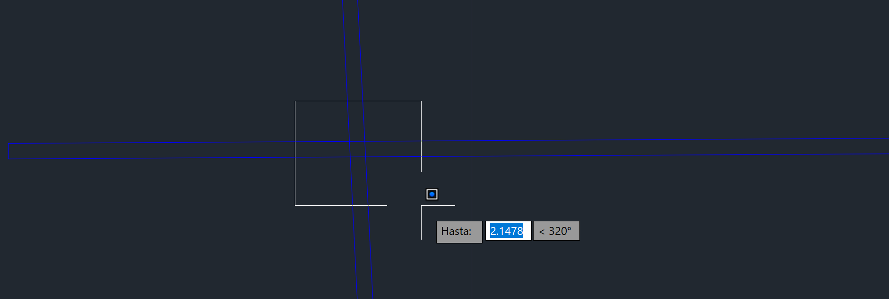

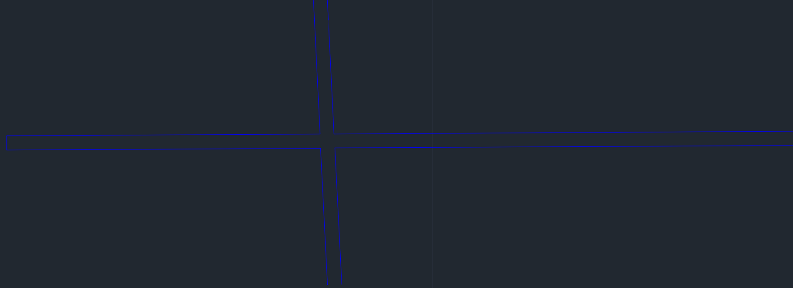

### m2 o metro2
Añade un un superíndice 2 al final de un texto que se seleccione.

**Nota**: el texto debe ser creado con la orden texto/text, no con texto multiple. De lo contrario la orden no funcionará.

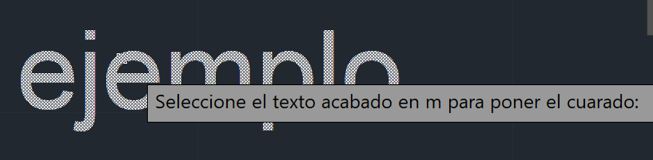

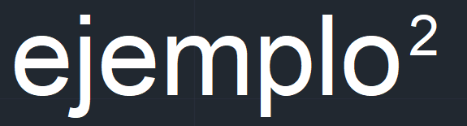